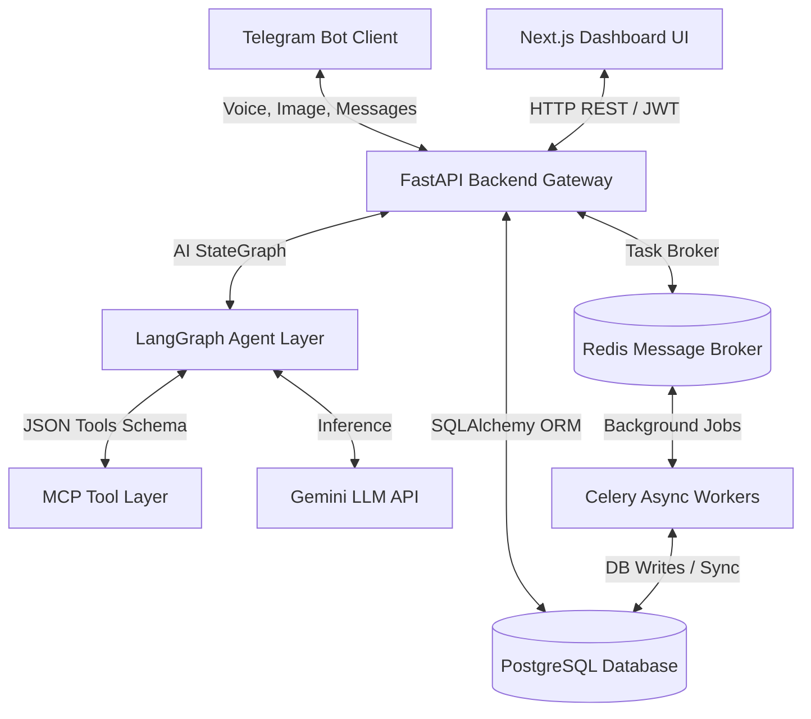

# System Architecture

The following diagram represents the core architecture and data flow of the AAROGYA Rural Healthcare Companion.

---

## Technology Stack

### Frontend
- **Next.js**: Single Page React framework for high-performance dashboard layouts.
- **TypeScript**: Strictly typed development.
- **TailwindCSS**: Premium responsive utilities and custom light healthcare color scheme.
- **Lucide Icons**: Modern high-fidelity interface assets.
- **Framer Motion**: Micro-animations and layout transitions.

### Backend
- **FastAPI**: Modern, high-performance web framework for Python.
- **SQLAlchemy**: Python SQL toolkit and Object Relational Mapper (ORM).
- **PostgreSQL**: Robust persistent relational database.
- **Redis**: Fast caching store and celery message broker.
- **Celery**: Distributed asynchronous task execution queue.

### AI Engine
- **Gemini**: Vision, OCR extraction, audio translation, and natural language explanations.
- **LangGraph**: Structured multi-agent workflow routing and conversational state management.

### Communication & Protocol
- **Telegram Bot API**: End-user messaging interface.
- **Model Context Protocol (MCP)**: Standardized schemas mapping clinical APIs directly to autonomous agent intents.
