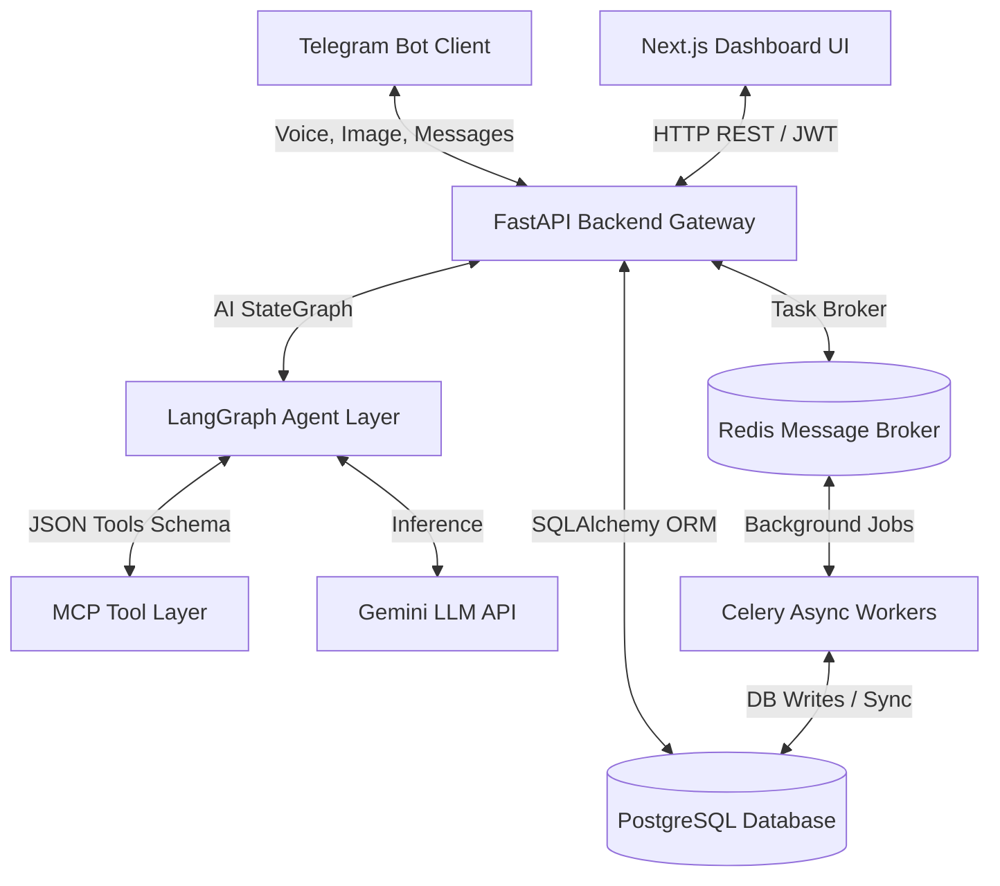

# 🌿 AAROGYA: AI-Powered Rural Healthcare Companion

AAROGYA is an agentic rural healthcare platform that connects patients in remote villages with doctors and healthcare workers (HCWs) through Telegram, AI-powered clinical tools, and a real-time web dashboard.

Patients interact via **Telegram** (voice, text, prescription photos, lab reports). Doctors and HCWs monitor compliance, risk alerts, and village health trends through a **Next.js Clinical Command Center** backed by **FastAPI**, **PostgreSQL**, **Redis/Celery**, and **Google Gemini 2.5 Flash**.

---

## Table of Contents

- [Features](#features)
- [System Architecture](#system-architecture)
- [Tech Stack](#tech-stack)
- [AI & MCP Integration](#ai--mcp-integration)
- [Environment Variables](#environment-variables)
- [Installation & Setup](#installation--setup)
- [Demo Flow Guide](#demo-flow-guide)
- [Screenshots & Visuals](#screenshots--visuals)
- [Access URLs & Credentials](#access-urls--credentials)

---

## Features

### Patient (Telegram Bot)
- **Telegram-only registration** — patients are added to the database exclusively via the bot (`/start`). Manual dashboard/API patient creation is disabled.
- Portal shows only patients with a valid `telegram_id` from bot onboarding (Real Data filter).
- Prescription photo upload → AI OCR → medicine extraction → reminder scheduling
- Lab report upload → biomarker parsing → patient-friendly explanation
- Daily symptom check-ins via text or voice
- Voice-based rural health assistant with AI response in the same language
- Medication compliance reminders with Taken / Missed inline buttons

### Doctor / HCW (Web Dashboard)
- **Clinical Command Center** — live metrics, village health score, AI executive insights
- **Patient Directory** — search, filter, full clinical profiles
- **Doctor Copilot** — AI recommendations, diagnosis, follow-up, lab tests, medication review
- **Predictive Risk Score** (0–100) with contributors and circular gauge
- **Prescription & Lab Report** viewers with OCR-extracted data
- **Risk Alerts** queue with acknowledge / resolve workflow
- **Activity Feed** — real-time timeline of patient events
- **HCW Checklist** — mobile-friendly visit task list from active alerts
- **Voice Assistant Widget** — record symptoms in regional languages
- **MCP Tools Console** — interactive protocol console for AI agents

### Platform
- Demo / Real data isolation (`is_demo` flag + data filters)
- Apple-style emoji rendering globally (twemoji)
- Light-mode healthcare UI (Apple Health + Google Health inspired)
- Gemini resiliency — workflows continue even if AI is temporarily unavailable
- Role-based access (Doctor, HCW, Admin)

---

## System Architecture



---

## Tech Stack

| Layer | Technology |
|-------|------------|
| **Backend API** | FastAPI, Python 3.11, Uvicorn |
| **Database** | PostgreSQL 15 |
| **Cache / Queue** | Redis 7, Celery 5 |
| **AI Engine** | Google Gemini 2.5 Flash, LangGraph |
| **Bot Integration** | python-telegram-bot 21 |
| **Frontend** | Next.js 14, TypeScript, Tailwind CSS |
| **UI Aesthetics** | Framer Motion, Lucide Icons, Twemoji (Apple) |
| **Authentication** | JWT (Bearer tokens) |
| **Containers** | Docker Compose |

---

## AI & MCP Integration

### AI Components (`AI_USAGE.md`)
AAROGYA uses LangGraph state machine routing and Gemini models to handle:
1. **Prescription OCR**: Digital extraction of medicine dosage and diagnosis.
2. **Biomarker Explainer**: Patient-friendly explanations of lab reports.
3. **Voice Translation**: Translation and speech synthesis of symptoms in regional languages (Tamil, Hindi, Telugu, Kannada, Malayalam, English).
4. **Reminder Extraction**: Transforming prescription text into daily scheduling tasks.

### Model Context Protocol (MCP) Tools
The FastAPI backend exposes standard MCP tools for patient search, risk assessment, and prescription lookups:
- `search_patient`: Query patient demographics.
- `get_patient_risk`: Retrieve risk level and risk factors.
- `get_patient_prescriptions`: Fetch active prescription records.
- `get_dashboard_summary`: Aggregate high-level village stats.

---

## Environment Variables

Configure `.env` file in the root directory:
```env
SECRET_KEY=openssl_rand_hex_32
POSTGRES_SERVER=db
POSTGRES_USER=postgres
POSTGRES_PASSWORD=postgres
POSTGRES_DB=aarogya
REDIS_URL=redis://redis:6379/0
TELEGRAM_BOT_TOKEN=your_telegram_bot_token
GEMINI_API_KEY=your_gemini_api_key
NEXT_PUBLIC_API_URL=http://localhost:8000/api/v1
```

---

## Installation & Setup

### 1. Clone and Configure
```bash
cp .env.example .env
```
Set your `TELEGRAM_BOT_TOKEN` and `GEMINI_API_KEY` in `.env`.

### 2. Run with Docker Compose
```bash
docker compose up --build -d
```
Verify the services show `Up` status by running `docker compose ps`.

### 3. Load Demo Data
Open `http://localhost:3000/login`, login as **Admin**, and click **🚀 Load Hackathon Demo** on the header bar.

---

## Demo Flow Guide

Follow this 2-minute demo flow for presentations:
1. **Dashboard Login**: Authenticate as Doctor or Admin.
2. **Onboard Patient**: Initiate onboarding using `/start` on the Telegram Bot.
3. **Vision Processing**: Upload a prescription card to the bot.
4. **Symptom Entry**: Record symptom check-ins using voice notes.
5. **Lookup (MCP Console)**: Navigate to **MCP Tools** (🧩) on the dashboard, input the patient UUID, and retrieve risk levels and active prescription listings.

---

## Screenshots & Visuals
The dashboard runs in a sleek, premium, light-mode medical design with Apple-inspired widgets and micro-animations. Screenshots are captured and referenced in the project artifacts directory.

---

## Access URLs & Credentials

| Service | URL |
|---------|-----|
| **Dashboard** | http://localhost:3000/login |
| **API Swagger Docs** | http://localhost:8000/docs |
| **Health Check** | http://localhost:8000/health |

**Login Credentials**:
- **Admin**: `9876543200` / `admin123`
- **Doctor**: `9876543210` / `doctor123`
- **HCW**: `9876543211` / `hcw123`
